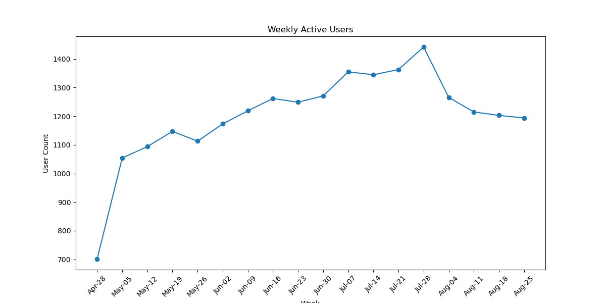

# Yammer Engagement Dip Analysis

## Problem
In the week ending **2014-08-26**, Yammer’s Weekly Active Users (WAU) fell by **12%**, one of the largest single-week drops on record. We need to determine the root cause and recommend corrective actions.

## Data Tables
**1. yammer_users**  
- `user_id`: Unique user identifier  
- `created_at`: Account creation timestamp  
- `state`: User status (`active` or `pending`)  
- `activated_at`: Time the user became active  
- `company_id`: Company affiliation  
- `language`: Preferred UI language  

**2. yammer_events**  
- `user_id`  
- `occurred_at`: Event timestamp  
- `event_type`: `signup_flow` or `engagement`  
- `event_name`: e.g. `create_user`, `home_page`, `send_message`, `login`, etc.  
- `location`: Country (by IP)  
- `device`: e.g. `desktop`, `phone`, `tablet`  

**3. yammer_emails**  
- `user_id`  
- `occurred_at`: Email event timestamp  
- `action`: `sent_weekly_digest`, `email_open`, `email_clickthrough`  

> _Dataset and scenario modeled after the [Mode Analytics](https://mode.com/sql-tutorial/a-drop-in-user-engagement) “Investigating a Drop in User Engagement” case study.

## Hypotheses & Analysis
| Hypothesis                                  | Analysis & Finding                                                                                                                                   | Next Step                                                                                                   |
|---------------------------------------------|------------------------------------------------------------------------------------------------------------------------------------------------------|-------------------------------------------------------------------------------------------------------------|
| **1. A slump in new user signups/activations drove the WAU decline** | Weekly activations dipped slightly the week of Aug 4 but quickly rebounded; this alone does not explain the continued WAU drop through Aug 26.       | Coordinate with the Marketing/Acquisition team to review any temporary changes in ad spend or onboarding UX. |
| **2. Specific tenure cohorts disproportionately contributed to the decline** | All tenure buckets (0–4w, 5–12w, 12w+) declined in parallel—no single cohort was responsible.                                                         | Set up cohort-based WAU dashboards to monitor if future dips are driven by a particular user age group.     |
| **3. A mobile-app or device-specific issue caused engagement to drop** | Mobile WAU dropped significantly after Aug 4, while desktop WAU remained flat—pointing to a mobile platform issue.                                   | Check with mobile engineering for recent app releases, regressions, or platform-specific bugs.              |
| **4. A drop in email-driven traffic reduced WAU** | Email send volume and open rates remained stable, but click-through rate (CTR) dropped by ~25% starting Aug 4.                                       | Add monitoring/alerts for email CTR. Flag any week-over-week CTR drops >10% for investigation.              |
| **5. Weekly digest email failure caused the drop** | CTR collapse was isolated to **weekly digest** emails. Digest sends dropped ~27% the week of Aug 26, perfectly aligned with the WAU decline.         | Work closely with the engineering and email product teams to audit scheduler logs, fix broken templates or links, and re-send the missed digest batch. |

## Summary
- WAU dropped 12% during the week of Aug 4.
- Root cause: Failure in the weekly-digest email system.
- Supporting evidence: Mobile engagement drop, digest CTR isolate, cohort-wide decline.
- Recommendation: Inspect user acquisition funnel, fix email pipeline, set up CTR monitoring.